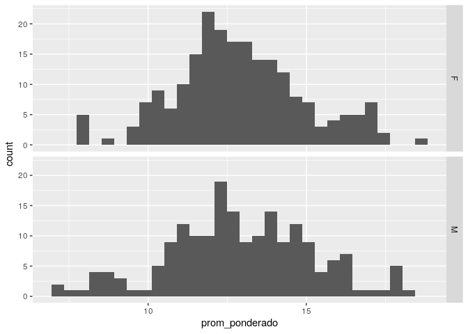

Solución a la Tarea de visualización usando ggplot2
================
Magdiel Ablan
9 de febrero de 2015

##### El archivo `DatosGraduadosSistemas.csv` contiene datos de los estudiantes graduados de Ingeniería de Sistemas desde el año 2000 al 2011. El encabezado de las columnas se explica por si solo.

##### 1\) Realice un gráfico que muestre si existen diferencias en el promedio de notas de los dos sexos

Hay muchas opciones para comparar las distribuciones de una variable
continua (las notas) con referencia a una variable factor (el sexo). Una
primera opción es hacer gráficos de caja. Primero con el promedio
ponderado:

``` r
p <- ggplot(grad, aes(sexo, prom_ponderado))

p + geom_boxplot(notch=T, aes(fill=sexo))  + theme(legend.position="none") + scale_y_continuous(name="Promedio ponderado") + scale_x_discrete(breaks=c("F", "M"),labels=c("Femenino", "Masculino")) +ggtitle("Estudiantes de Sistemas (2000- 2011)")
```

<!-- -->

y luego con el promedio general:

``` r
q <- ggplot(grad, aes(sexo, prom_general))
q + geom_boxplot(notch=T, aes(fill=sexo))  + theme(legend.position="none") + scale_y_continuous(name="Promedio general") + scale_x_discrete(breaks=c("F", "M"),labels=c("Femenino", "Masculino")) +ggtitle("Estudiantes de Sistemas (2000- 2011)")
```

<!-- -->

Otras formas de visualizar esto es a través de la comparación de los
histogramas para los diferentes sexos. Aquí con ggplot se tienen dos
opciones. La primera es usar “facets”, una para cada sexo:

``` r
ggplot(grad, aes(x=prom_ponderado)) + geom_histogram() +
  facet_grid(sexo ~ .)
```

    ## `stat_bin()` using `bins = 30`. Pick better value with `binwidth`.

<!-- -->

La segunda es sobreponer ambos en el mismo gráfico:

``` r
ggplot(grad, aes(x=prom_ponderado, fill=sexo)) +
  geom_histogram(position="identity", alpha=0.4)
```

    ## `stat_bin()` using `bins = 30`. Pick better value with `binwidth`.

<!-- -->

Lo mismo se puede hacer en términos de gráficos de densidad. Aquí tres
opciones diferentes. La primera, en el mismo gráfico, sólo las lineas de
densidad:

``` r
ggplot(grad, aes(x=prom_ponderado, colour=sexo)) + geom_density()
```

<!-- -->

La segunda, coloreando el área bajo la curva. El valor de alpha controla
la transparencia al sobreponerse ambas curvas:

``` r
ggplot(grad, aes(x=prom_ponderado, fill=sexo)) + geom_density(alpha=.3)
```

<!-- -->

Finalmente, usando
paneles:

``` r
ggplot(grad, aes(x=prom_ponderado)) + geom_density() + facet_grid(sexo ~ .)
```

<!-- -->

En general, no parecen existir diferencias significativas en el promedio
entre los sexos ni el promedio ponderado ni en el
general

-----

##### 2\. Algunas personas afirman que los estudiantes más jóvenes se gradúan con mejores promedios que los estudiantes mayores. Para este grupo de datos en particular, realice un gráfico que permita visualizar si es o no cierta esta afirmación.

Una primera
aproximación:

``` r
ggplot(grad, aes(x=año_nacimiento, y=prom_general)) + geom_point() +stat_smooth() + scale_y_continuous(name="Promedio general") + scale_x_continuous(name = "Año de nacimiento") +ggtitle("Estudiantes de Sistemas (2000- 2011)")
```

    ## `geom_smooth()` using method = 'loess' and formula 'y ~ x'

<!-- -->

Una segunda, utilizando ahora también el
sexo:

``` r
ggplot(grad, aes(x=año_nacimiento, y=prom_general,color=sexo)) + geom_point() +stat_smooth() + scale_y_continuous(name="Promedio general") + scale_x_continuous(name = "Año de Nacimiento") +ggtitle("Estudiantes de Sistemas (2000- 2011)")
```

    ## `geom_smooth()` using method = 'loess' and formula 'y ~ x'

<!-- -->

Mirando estos gráfico parece que, en efecto, los estudiantes más jóvenes
se graduan con mejores promedios que los estudiantes
mayores.

-----

##### 3\. Realice un gráfico que muestre como cambia el promedio de notas con el número de años de estudio de la carrera.

Una primera
manera:

``` r
ggplot(grad, aes(x=años_estudio, y=prom_general)) + geom_point() +stat_smooth() + scale_y_continuous(name="Promedio general") + scale_x_continuous(name = "Años de estudio") +ggtitle("Estudiantes de Sistemas (2000- 2011)")
```

    ## `geom_smooth()` using method = 'loess' and formula 'y ~ x'

<!-- -->

Una segunda:

``` r
q <- ggplot(grad, aes(factor(años_estudio), prom_general))
q + geom_boxplot() + theme(legend.position="none") + scale_y_continuous(name="Promedio general") + ggtitle("Estudiantes de Sistemas (2000- 2011)")
```

<!-- -->

-----

Un refinamiento de este gráfico sería estudiar la relación por rangos
separados. Por ejemplo, separar estudiantes que se graduan en 5 años o
menos, los que se graduan de 6 a 8 años y el resto.

A pesar de las anomalias y los pocos datos que se tienen para algunas de
las longitudes mayores se puede afirmar en terminos generales que
mientras más años dura una persona estudiando la carrera más bajo es su
promedio al graduarse
