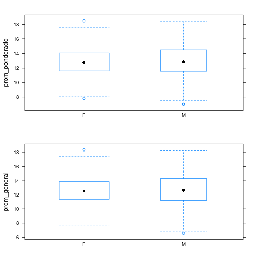
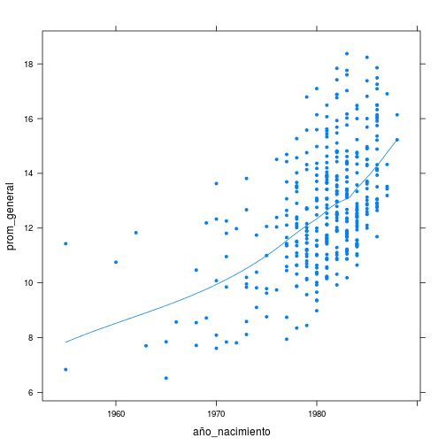
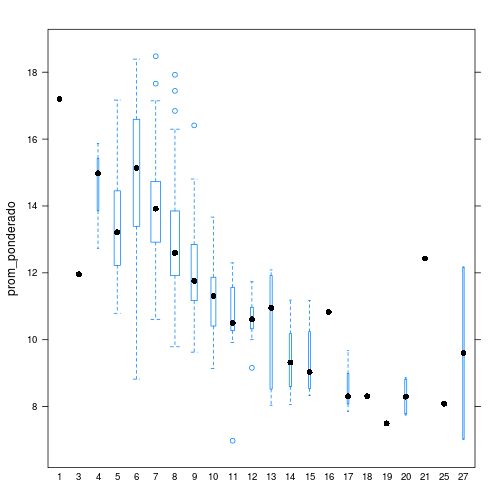

Solución a la Tarea 4
========================================================


#### El archivo ```DatosGraduadosSistemas.csv``` contiene datos de los estudiantes graduados de Ingeniería de Sistemas desde el año 2000 al 2011. El encabezado de las columnas se explica por si solo.

#### 1) Realice un gráfico que muestre si existen diferencias en el promedio de notas de los dos sexos


```r
h1 <- bwplot(prom_ponderado ~ factor(sexo), data = grad, varwidth = T)
h2 <- bwplot(prom_general ~ factor(sexo), data = grad, varwidth = T)
plot(h1, split = c(1, 1, 1, 2), more = TRUE)
plot(h2, split = c(1, 2, 1, 2), new.page = FALSE)
```

 


No existen diferencias en el promedio entre los sexos ni el promedio ponderado ni en el general

-----------------------

#### 2. Algunas personas afirman que los estudiantes más jóvenes se gradúan con mejores promedios que los estudiantes mayores. Para este grupo de datos en particular, realice un gráfico que permita visualizar si es o no cierta esta afirmación. Extra puntos si a su gráfico le sobrepone una curva describiendo la tendencia (Indicación: En el vídeo visto en clase se muestra como hacer esto utilizando loess).


```r
xyplot(prom_general ~ año_nacimiento, data = grad, pch = 20, panel = function(x, 
    y, ...) {
    panel.xyplot(x, y, ...)
    panel.loess(x, y)
})
```

 


Mirando este gráfico parece que, en efecto, los estudiantes más jóvenes se graduan con mejores promedios que los estudiantes mayores. 

---------------------

#### 3. Realice un gráfico que muestre como cambia el promedio de notas  con el número de años de estudio de la carrera.


```r
bwplot(prom_ponderado ~ factor(años_estudio), data = grad, varwidth = T)
```

 

-----------------
El uso de ```varwidth``` permite que el ancho de las cajas sea variable para reflejar el número de observaciones que las componen. A pesar de las anomalias y los pocos datos que se tienen para algunas de las longitudes mayores se puede afirmar en terminos generales que mientras más años dura una persona estudiando la carrera más bajo es su promedio al graduarse
