Mas ejemplos: Modelización de entradas usando fitdistrplus
================
Magdiel Ablan
8 de enero de 2016

1.  Los datos en: `premio gordo.txt` son los resultados históricos del
    premio gordo de la loteria española de la navidad (fuente:
    <http://www.eleconomista.es/especiales/loteria-navidad/premiados.php>).
    Realice los analisis correspondientes para verificar el tipo de
    distribución estadistica de estos datos.

<!-- end list -->

``` r
datos=read.table("premio\ gordo.txt",header=F,sep="\t")
deMenosaMas=order(datos$V1)
premio=data.frame(A=datos$V1[deMenosaMas],Numero=datos$V2[deMenosaMas])
ganadores=premio$Numero
n=length(ganadores)
```

1.  Verificando la independencia de los
datos

<!-- end list -->

``` r
acf(ganadores)
```

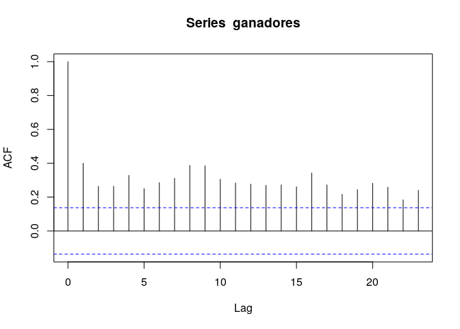<!-- -->

``` r
plot(premio$A,ganadores,type="l",xlab="Años",ylab="Premio",main="Ganadores")
```

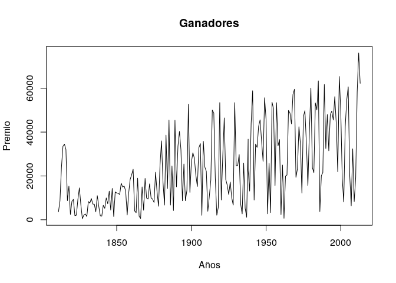<!-- -->

Sorpresivamente, los gráficos muestran que:

  - Hay una clara evidencia de correlación serial lo que indica que no
    parecen provenir de un muestreo aleatorio.

  - Parece que el rango de los datos es menor en los primeros años.

El supuesto de independencia de la muestra es clave para la realización
de pruebas de bondad del ajuste y para la estimación de parámetros por
el método de máxima verosimilitud. Por lo que cabría preguntarse por la
fidelindad de la fuente e investigar un poco la historia del asunto para
poder modelizarlos adecuadamente.

Wikipedia
(<https://es.wikipedia.org/wiki/Loter%C3%ADa_Nacional_de_Espa%C3%B1a>)
reporta dos maneras diferentes de realizar la selección: Usando un
sistema tradicional y uno moderno. El moderno se empezó a aplicar desde
1965. Quizás ambas formas no son equivalentes. Además, hasta 1913 los
sorteos se hicieron con papel. A partir de 1850 se usaron los primeros
biombos de metal
(<http://www.laloterianavidad.com/sorteo-navidad/historia.html>). Otros
hablan de tendencias como:
<http://www.laloterianavidad.com/noticia/gordo-suele-numero-par-352.html>.
Si una investigacion somera por internet revela estos hechos, quizas no
es tan descabellado pensar que la serie dedatos no son equivalentes y
quizás otros cambios ni siquera fueron documentados.

El histograma y las estadísticas básicas confirman que estos datos *NO*
provienen de una distribución uniforme, que sería los esperado en este
tipo de situaciones

``` r
summary(ganadores)
```

    ##    Min. 1st Qu.  Median    Mean 3rd Qu.    Max. 
    ##     523    8506   18922   23516   35844   76058

``` r
var(ganadores)
```

    ## [1] 329143928

``` r
desv=sd(ganadores)
cvar = sd(ganadores)/mean(ganadores)
cvar
```

    ## [1] 0.7714837

``` r
media=mean(ganadores)
par(mfrow=c(1,2))
hist(ganadores,prob=T)
lines(density(ganadores))
boxplot(ganadores)
```

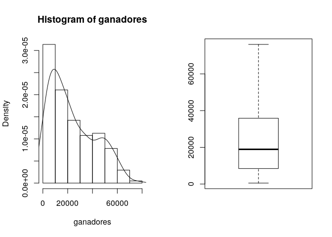<!-- -->

Como no se pueden sumar peras y manzanas y no tenemos suficiente
información al respecto, hasta aquí llega nuestra investigación de este
conjunto de datos.

-----

2.  Los datos es `lluvia.txt` corresponden a un historico de eventos de
    precipitacion en una pequeña cuenca del paramo de Mixteque durante
    el 2013. ¿Qué distribución o distribuciones servirían para modelizar
    este tipo de datos?. Justifique su respuesta

Vamos a resolver este problema usando una nueva librería,
`fitdistrplus`. Esta librería automatiza varias de las tareas que hemos
visto y es mucho mas robusta que fitdistr para el cálculo de los
parámetros (produce menos advertencias). Una descripción y breve
tutorial del paquete puede conseguirse en:
<https://cran.r-project.org/web/packages/fitdistrplus/vignettes/paper2JSS.pdf>

Primero, leemos los datos:

``` r
lluvia = scan("lluvia.txt")
n =length(lluvia)
```

y verificamos si son o no independientes:

Un primer gráfico que puede ser de ayuda es el gráfico de
autocorrelación:

``` r
acf(lluvia)
```

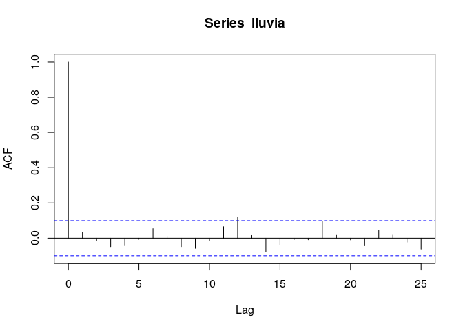<!-- -->

De acuerdo a este gráfico los datos no parecen estar correlacionados
serialmente. Tampoco se ven ciclos o tendencias obvios en el gráfico de
las observaciones a lo largo del tiempo:

``` r
ts.plot(lluvia)
```

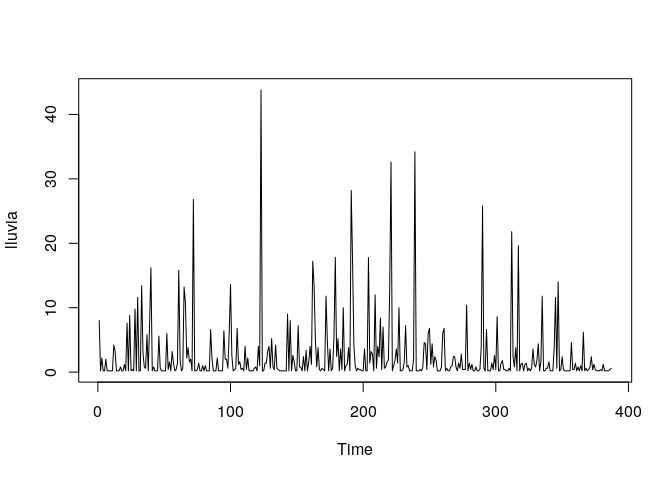<!-- --> Como los
datos son independientes, podemos proceder con las siguientes fases como
antes:

2.  Formular una distribución probable para los datos

En esta fase hacemos gráficos de la distribucion y calculamos
estadísticas básicas que nos permitan hacer una o varias hipótesis
sobre la distribución de los datos. Usaremos fitdistrplus:

``` r
library(fitdistrplus)
```

    ## Loading required package: MASS

    ## Loading required package: survival

    ## Loading required package: npsurv

    ## Loading required package: lsei

``` r
plotdist(lluvia,demp=T)
```

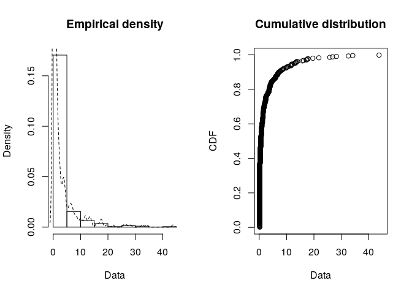<!-- -->

Las estadísticas básicas comparadas con sus valores para las
distribuciones estándar se muestran en el siguiente gráfico:

``` r
descdist(lluvia,boot=1000)
```

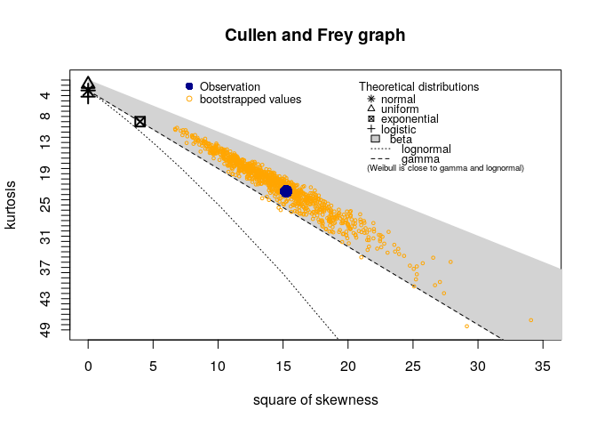<!-- -->

    ## summary statistics
    ## ------
    ## min:  0.2   max:  43.801 
    ## median:  0.6 
    ## mean:  2.666705 
    ## estimated sd:  5.221638 
    ## estimated skewness:  3.904217 
    ## estimated kurtosis:  22.38626

Dada la naturaleza de los datos intentaremos ajustar una gamma, una
weibull y una lognormal:

``` r
fw <- fitdist(lluvia, "weibull")
fg<-fitdist(lluvia,"gamma")
fln<-fitdist(lluvia,"lnorm")
```

y ahora comparamos el ajuste con los diferentes gráficos:

``` r
plot.legend <- c("Weibull", "lognormal", "gamma")
denscomp(list(fw, fln, fg), legendtext = plot.legend)
```

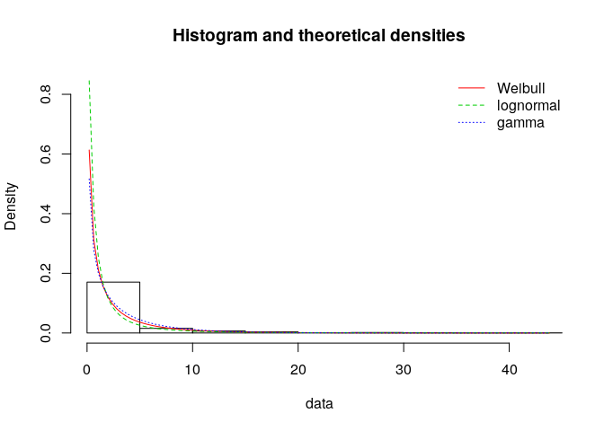<!-- -->

``` r
qqcomp(list(fw, fln, fg), legendtext = plot.legend)
```

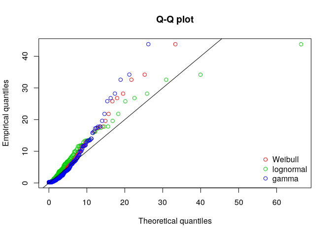<!-- -->

``` r
cdfcomp(list(fw, fln, fg), legendtext = plot.legend)
```

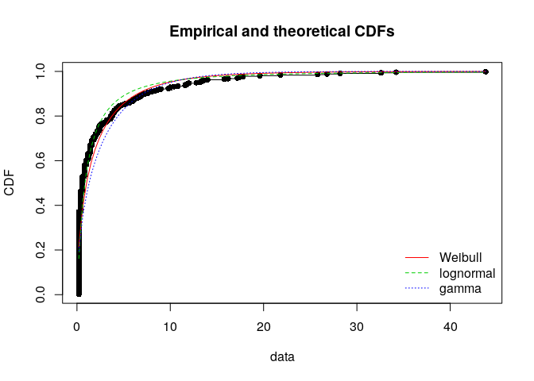<!-- -->

``` r
ppcomp(list(fw, fln, fg), legendtext = plot.legend)
```

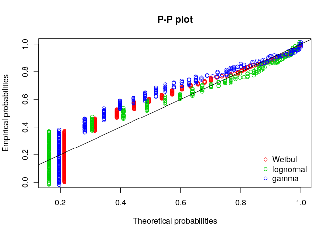<!-- -->

El gráfico de probabilidad-probabilidad se interpreta de manera similar
al de cuantiles (qqplot) pero mientras este hace enfásis en el ajuste en
las colas de la distribución el primero lo hace más en el centro de la
misma

Finalmente, hacemos las pruebas de bondad del ajuste:

``` r
gofstat(list(fw,fln, fg), fitnames = c("weibull", "lnormal", "gamma"))
```

    ## Goodness-of-fit statistics
    ##                                 weibull    lnormal     gamma
    ## Kolmogorov-Smirnov statistic  0.2136904  0.2098868  0.195959
    ## Cramer-von Mises statistic    3.1481148  2.6672026  4.682460
    ## Anderson-Darling statistic   19.2703784 17.6240414 25.927016
    ## 
    ## Goodness-of-fit criteria
    ##                                 weibull  lnormal    gamma
    ## Akaike's Information Criterion 1358.924 1252.492 1410.960
    ## Bayesian Information Criterion 1366.841 1260.409 1418.876

De acuerdo a este reporte, la mejor parecería ser la distribución
lognormal.
