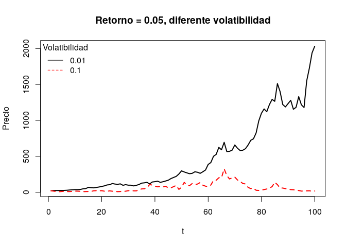
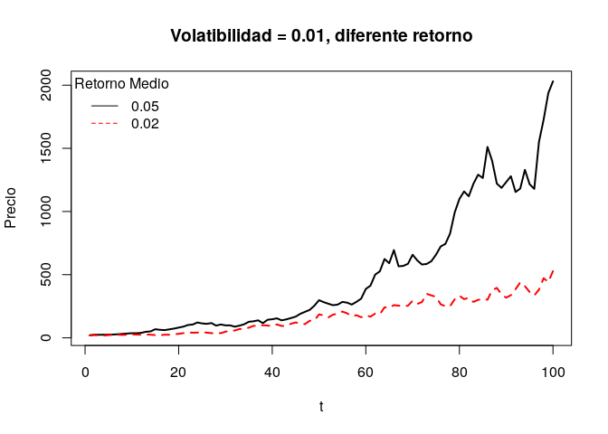

Ejemplo:Simulación de Precios de Acciones en la Bolsa
================
Magdiel Ablan
23/03/2015

Ejercicio propuesto en: Jones Owen, Robert Maillardet, and Andrew
Robinson. 2009. *Introduction to Scientific Programming and Simulation
Using R*. Chapman and Hall/CRC

## Simulación de Precios de Acciones en la Bolsa

Un modelo para los precios de índices bursátiles usado comúnmente es el
modelo de movimiento geométrico browiano. Sea S(i) el precio de una
acción al cierre del día i. El modelo browniano es:

\[ S(i+1) = S(i)e^{\mu-\frac{1}{2} \sigma^2+\sqrt{\sigma^2}Z(i+1)} \]

donde donde Z(i) son VA normales estándar. A \(\mu\) se le llama el
retorno medio y a \(\sigma^2\) la volatilidad. Ambos parámetros deben
ser estimados del comportamiento previo del índice bursátil.

1.  Escriba un programa que tome como entrada los valores de \(\mu\),
    \(\sigma^2\), S(0) y t, simule S(1), S(2),….S(t) y los grafique.
    Incluya en su reporte gráficos ejemplo de por lo menos dos valores
    de \(\sigma^2\) y \(\mu\) y describa cualitativamente que pasa.

La siguiente función calcula la evolución de la bolsa con los parámetros
dados por T unidades de tiempo:

``` r
bolsa<-function(T,mu,sigma2,S0) {
  S<-numeric(T)
  S[1]<-S0
  for (i in 1:(T-1)) {
    S[i+1] = S[i]*exp(mu-0.5*sigma2 + sqrt(sigma2)*rnorm(1))
  }
 return(S)
}
```

Y ahora realizamos varias corridas comparando el efecto de los dos
parámetros:

``` r
set.seed(321)
T<-100
t<-seq(1,T)
S1<-numeric(T); S2<-numeric(T); S3<-numeric(T)

S1<-bolsa(T,0.05,0.01,20)
S2<-bolsa(T,0.05,0.1,20)
S3<-bolsa(T,0.02,0.01,20)
```

Y hacemos los gráficos correspondientes para visualizar mejor el efecto
de los parámetros. Este gráfico compara el efecto de diferentes valores
de
volatibilidad:

``` r
plot(t,S1,type="l",xlab="t",lwd=2,ylab="Precio",main="Retorno = 0.05, diferente volatibilidad")
lines(t,S2,lwd=2,lty=2,col=2)
texto<-c("0.01","0.1")
legend("topleft",texto,title="Volatibilidad",lty=c(1,2),col=c(1,2),lwd=c(1,1),bty="n")
```

<!-- -->

Y este el efecto de diferentes valores de
retorno:

``` r
plot(t,S1,type="l",xlab="t",lwd=2,ylab="Precio",main="Volatibilidad = 0.01, diferente retorno")
lines(t,S3,lty=2,lwd=2,col=2)
texto<-c("0.05","0.02")
legend("topleft",texto,lty=c(1,2),col=c(1,2),title="Retorno Medio",lwd=c(1,1),bty="n")
```

<!-- -->

2.  Utilice el programa anterior para simular por lo menos 10000
    realizaciones y estimar E(S(t)) y P(S(t) \> S(0)). Calcule
    intervalos de confianza del 95% para ambas cantidades. Use el
    programa para completar la siguiente tabla: Utilice como semilla 321
    antes de comenzar a hacer los cálculos.

| \(\mu\)                  | 0.05   | 0.01   | 0.01 |
| ------------------------ | ------ | ------ | ---- |
| \(\sigma^2\)             | 0.0025 | 0.0025 | 0.01 |
| E\[S(100)\]              |        |        |      |
| 95% IC E(S(100))         |        |        |      |
| P(S(100) \> S(0))        |        |        |      |
| 95% IC P(S(100) \> S(0)) |        |        |      |

En lo siguiente S100a representa los cálculos para la primera columna,
S100b para la segunda y S100c para la tercera:

``` r
m<-1000
T<-100
S0= 100

s100a<-numeric(m)
s100a<-replicate(m,expr={S1<-bolsa(T,0.05,0.0025,S0);S1[100]})
s100a.estas<-t.test(s100a)

s100b<-numeric(m)
s100b<-replicate(m,expr={S2<-bolsa(T,0.01,0.0025,S0);S2[100]})
s100b.estas<-t.test(s100b)

s100c<-numeric(m)
s100c<-replicate(m,expr={S3<-bolsa(T,0.01,0.01,S0);S3[100]})
s100c.estas<-t.test(s100c)
```

Y los cálculos asociados a las dos últimas filas de la tabla son como
sigue. Note que para el primer caso siempre S(100) es mayor a S(0) y por
lo tanto la instrucción para el cálculo de confianza genera un error,
por eso se encuentran comentadas

``` r
#s0a<-numeric(m)
#s0a<-as.numeric(s100a > S0)
#s0a.estas<-t.test(s0a)

s0b<-numeric(m)
s0b<-as.numeric(s100b > S0)
s0b.estas<-t.test(s0b)

s0c<-numeric(m)
s0c<-as.numeric(s100c > S0)
s0c.estas<-t.test(s0c)
```

Así, la tabla queda
como:

| \(\mu\)                  | 0.05                             | 0.01                     | 0.01                     |
| ------------------------ | -------------------------------- | ------------------------ | ------------------------ |
| \(\sigma^2\)             | 0.0025                           | 0.0025                   | 0.01                     |
| E\[S(100)\]              | 1.400793610^{4}                  | 272.5183446              | 246.6581194              |
| 95% IC E(S(100))         | 1.354907310^{4}, 1.446679810^{4} | 263.1095653, 281.9271238 | 227.4535787, 265.8626601 |
| P(S(100) \> S(0))        | 1                                | 0.958                    | 0.679                    |
| 95% IC P(S(100) \> S(0)) | \-                               | 0.9455463, 0.9704537     | 0.6500146, 0.7079854     |
