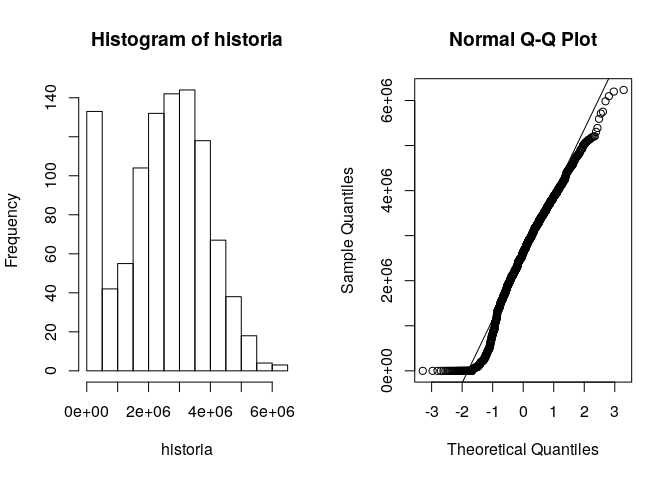

Ejemplo:Simulación del Riesgo de una Compañia Aseguradora
================
Magdiel Ablan
23/03/2015

Ejercicio propuesto en: Jones Owen, Robert Maillardet, and Andrew
Robinson. 2009. *Introduction to Scientific Programming and Simulation
Using R*. Chapman and Hall/CRC

## Simulación del Riesgo de una compañía aseguradora

Esta es una versión simplificada de dos problemas que enfrentan las
compañías aseguradoras: Calcular la probabilidad de quebrar y estimar
cuanto dinero pueden hacer. Suponga que una compañía de seguros tiene un
capital de 1,000,000 Bs. La compañía tiene 1000 clientes, cada uno de
los cuales paga una póliza anual de 5500 Bs al comienzo del año. Basado
en su experiencia previa se estima que la probabilidad de que un cliente
realice una solicitud de reclamo es p = 0.1 por año, independientemente
de los reclamos previos y de otros clientes. El tamaño X de los reclamos
varia y tiene la siguiente densidad con alfa = 3 y beta = 100,000:


A X se le denomina distribución de Pareto y tiene varios usos
importantes en economía.

Consideraremos las ganancias de la compañía sobre un período de cinco
años. Sea Z(t) el balance de la compañía al final del año t. Así:


Note que si Z(t) cae a 0 o por debajo permanecerá allí. Es decir, una
vez en quiebra la compañía no se recupera.

#### 1\. Simulación de X:

1)  Investigue o derive F(X).

Se calcula de la manera usual, mediante integración de f(x) y se obtiene
la siguiente expresión:


2)  Escriba una función para simular X

Lo más sencillo es por el método de transformación inversa:


La función sería:

``` r
rpareto<-function(n,alfa,beta) {
        u<-runif(n)
        x<-beta*((1/u^(1/alfa))-1)
  return(x)
}
```

y para propósitos de comparación:

``` r
dpareto<-function(x,alfa,beta) {
  t<-(alfa*beta^alfa)/(x+beta)^(alfa+1)
        return(t)

}
```

3)  Evalúe su rutina utilizando algún método gráfico o de otra índole.

El siguiente código ejecuta las funciones anteriores y produce un
gráfico de comparación:

``` r
set.seed(123)
beta<-100000
alfa<-3
n<-1000

muestra<-rpareto(n,alfa,beta)
hist(muestra,prob=T,breaks="Scott",xlab="Monto reclamo",main="Densidad de Pareto (3,100000)")
curve(dpareto(x,alfa,beta),add=T,col="red")
```

<!-- -->

-----

#### 2\. Simulación de Z: Escriba una función para estimar Z para un período de 5 años. Utilice esta función para:

1)  Graficar varias realizaciones de Z vs. tiempo

La siguiente función calcula el balance para el período
considerado:

``` r
balance<-function(inicio=1000000, p=0.1,nclientes=1000,precio_poliza=5500,years=5) {
polizas<-precio_poliza*nclientes
z<-numeric(years)
zini<-1000000
for (i in 1:years) {
  u<-runif(nclientes)
    reclamos<-u<=p
    nreclamos<- sum(reclamos)
    montos<-rpareto(nreclamos,alfa,beta)
    total.reclamos<-sum(montos)
        if (i==1) z[i]<-zini + polizas -total.reclamos
    else z[i]<-z[i-1] + polizas -total.reclamos
        if (z[i] < 0 ) {
        z[i]<-0 
        break()
     }
}
return(z)
}
```

Algunas llamadas a la función:

``` r
balance()
```

    ## [1]  842407.2 1204146.5 1578808.2 1824343.5 2242701.6

``` r
balance()
```

    ## [1]  946740.4 1281613.0 2533930.6 4791293.9 4895151.9

``` r
balance()
```

    ## [1] 2764783 2819051 3155073 3816233 4155674

y el gráfico con varias realizaciones:

``` r
nrealiza<-10
varias<-matrix(0,nrow=nrealiza,ncol=6)
for (j in 1:nrealiza) {
  varias[j,2:6]<-balance()
  varias[j,1]<-1000000
}
maximo<-max(varias)
minimo<-min(varias)
plot(0:5,varias[1,],type="n",xlim=c(0,5),ylim=c(minimo,maximo),xlab="Tiempo",ylab="Ganancias")
for (j in 1:nrealiza) lines(0:5, varias[j,],col=j,lty=j,lwd=2)
```

<!-- -->

2)  Estimar la probabilidad de que la compañía quiebre Para estimar la
    probabilidad de quiebra y las ganancias esperadas corremos el
    algoritmo de balance muchas veces:

<!-- end list -->

``` r
m<-1000
historia<-numeric(m)
quiebra<-0
for (i in 1:m) {
  cincoY<-balance()
    if (any (cincoY==0)) quiebra<-quiebra + 1
    historia[i] <- mean(cincoY)
}
```

La probabilidad de quiebra es entonces:

``` r
pquiebra<-quiebra/m
print(pquiebra)
```

    ## [1] 0.16

``` r
#Error estandar de la probabilidad de quiebra:
sqrt((1-pquiebra)*pquiebra/m)
```

    ## [1] 0.0115931

3)  Estimar las ganancias esperadas al finalizar el período de 5 años.

<!-- end list -->

``` r
gananciaE<-mean(historia)
print(gananciaE)
```

    ## [1] 2498567

4)  Calcule un intervalo de confianza del 95% para las ganancias
    esperadas.

El intervalo de confianza para las ganancias es mejor calcularlo usando
una prueba no?parmetrica ya que la distribución dista bastante de una
normal:

``` r
par(mfrow=c(1,2))
hist(historia)
qqnorm(historia)
qqline(historia)
```

<!-- -->

y el intervalo sería:

``` r
ic.wil<-wilcox.test(historia,conf.int=T)
ic.wil
```

    ## 
    ##  Wilcoxon signed rank test with continuity correction
    ## 
    ## data:  historia
    ## V = 453628, p-value < 2.2e-16
    ## alternative hypothesis: true location is not equal to 0
    ## 95 percent confidence interval:
    ##  2566110 2738297
    ## sample estimates:
    ## (pseudo)median 
    ##        2653354

Las ganancias promedio al termino de los cinco años se encuentran entre
2.566110310^{6} y 2.738296910^{6}

Si lo hacemos con la normal obtenemos:

``` r
ic.t<-t.test(historia,conf.int=T)
ic.t
```

    ## 
    ##  One Sample t-test
    ## 
    ## data:  historia
    ## t = 57.403, df = 999, p-value < 2.2e-16
    ## alternative hypothesis: true mean is not equal to 0
    ## 95 percent confidence interval:
    ##  2413152 2583982
    ## sample estimates:
    ## mean of x 
    ##   2498567

En este caso se predicen menores ganancias con limites dados por
2.413152310^{6} y 2.583981810^{6}
