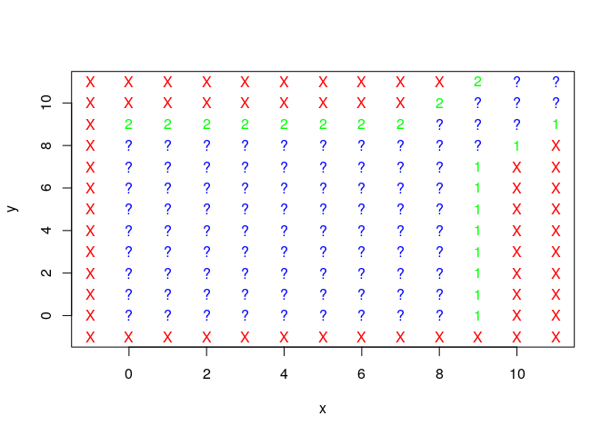
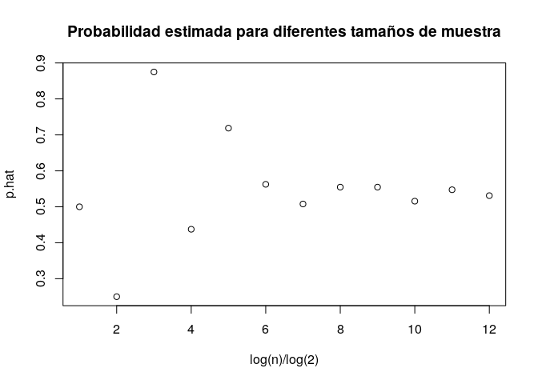

Juego de Squash
================
Magdiel Ablan
11 de marzo de 2016

El juego de squash lo juegan dos personas: jugador 1 y jugador 2. El
juego consiste en una secuencia de puntos.Si el jugador i sirve y gana
el punto su puntuación se incrementa en 1 y sigue sirviendo.Si el
jugador i sirve y pierde el punto el servicio se transfiere al otro
jugador y la puntuación permanece igual.

El ganador es la primera persona que alcanza una puntuación de 9, a
menos que la puntuación sea de 8 para ambos primero. Si este fuera el
caso el juego continua hasta que un jugador se encuentra dos puntos por
arriba del otro en cuyo caso, él es el ganador.

El objetivo de esta tarea es simular un juego de squash y estimar la
probabilidad de que gane el jugador 1. Definimos:
\[a=\mathbb{P}(jugador\:  1\: gana\: punto\:/\: jugador\: 1\: sirve)\]
\[b=\mathbb{P}(jugador\:  1\: gana\: punto\: /\: jugador\: 2\: sirve)\]
\[x= puntuacion\: jugador\: 1\] \[y= puntuacion\: jugador\: 2\]
\[z=\left\{\begin{matrix}
1 & si\: el\: jugador\: 1\: esta\: sirviendo \\ 
2 & si\: el\: jugador\: 2\: esta\: sirviendo 
\end{matrix}\right.\]

### Estado del juego

Escriba una función `status` que tome como entrada x y y retorne uno de
los siguientes mensajes.

`sin terminar`: si el juego aun no ha finalizado

`ganó 1`: si el jugador 1 ganó

`ganó 2`: si el jugador 2 ganó

`imposible`: si la puntuación no es válida

Puede asumir que las entrada x y y son números enteros.

``` r
status<-function(x,y) {
  diferencia = abs(x-y)
  mayor=max(x,y)
  if ((x < 0) | (y<0)) {
    status="imposible" 
    return(status)
  }
  
  if ((mayor > 9) & (diferencia >= 3)) {
    status="imposible" 
    return(status)
  }
  
  

  if (mayor <= 8) {
    status="sin terminar"
    return(status)
  }
  if (mayor>=9) {
    if (diferencia<2) {
      status="sin terminar"
      return(status)
    } 
    else if (mayor==x) {
          status="Gana 1"
          return(status)
          } else if (mayor==y) {
                  status="Gana 2"
                  return(status)
                  } else {
                    status="imposible"
                    return(status)
                  }
        }
    
  }
```

Una vez que haya escrito la función, cargue la función `status.test`
dada a continuación:

``` r
status.test <- function(s.ftn) {
x.vec <- (-1):11
y.vec <- (-1):11
plot(x.vec, y.vec, type = "n", xlab = "x", ylab = "y")
for (x in x.vec) {
  for (y in y.vec) {
    s <- s.ftn(x, y)
  if (s == "imposible") text(x, y, "X", col = "red")
  else if (s == "sin terminar") text(x, y, "?", col = "blue")
  else if (s == "Gana 1") text(x, y, "1", col = "green")
  else if (s == "Gana 2") text(x, y, "2", col = "green")
}
}
return(invisible(NULL))
}
```

La ejecución:

``` r
status.test(status)
```

<!-- -->

### Simulación de un juego

El vector `estado=(x,y,z)` describe el estado actual de un juego.
Escriba una función `play_point` que toma como entradas: `estado`, `a` y
`b`, simula la jugada de un punto y luego devuelve el valor actualizado
de `estado` representando el nuevo estado del juego.

``` r
play_point<-function(estado,a,b) {
  x=estado[1]
  y=estado[2]
  z=estado[3]
  
  #El jugador 1 tiene el servicio:
  if (z==1) {               
    u<-runif(1)
    #si gana o pierde  
    if (u<=a) x=x+1 else z=2
  } else {
    #El jugador 2 tiene el servicio
    u<-runif(1)
    #si pierde o gana  
    if (u<=b) z=1 else y=y+1
  }
  estado=c(x,y,z)
}
```

Ahora, codifique la funcion `play_game` exactamente como sigue:

``` r
play_game <- function(a, b) {
state <- c(0, 0, 1)
while (status(state[1], state[2]) == "sin terminar") {
# show(state)
state <- play_point(state, a, b)
}
if (status(state[1], state[2]) == "Gana 1") {
return(TRUE)
} else {
return(FALSE)
}
}
```

Si su función `status` y `play_point` funcionan adecuadamente, la
función `play_game` simula un juego de squash y devuelve TRUE si el
jugador 1 gana y FALSE en caso contrario.

Se define:
\(p(a,b)=\mathbb{P}(jugador\: 1\: gana\: juego\:/jugador\: 1\: sirve\: primero)\).
Realice la simulación de *n* juegos, estimando p(0.55,0.45) para
n=2<sup>k</sup> y k = 1,2,..12. Luego, grafique los resultados como en
la figura 22.9.

Primero, hacemos una función que calcula la probabilidad de que el
jugador gane en n juegos dados a y b:

``` r
prob_ganar<-function(a,b,n){
  sum(as.integer(replicate(n,play_game(a,b))))/n
}
```

y luego, la llamamos repetidas veces para hacer el gráfico:

``` r
set.seed(1)
k=1:12
n=2^k
ejex=log(n)/log(2)
ejey=numeric(12)

for (i in 1:12) {
  ejey[i]=prob_ganar(0.55,0.45,n[i])
}

plot(ejex,ejey,type="p",main="Probabilidad estimada para diferentes tamaños de muestra",xlab="log(n)/log(2)",ylab="p.hat")
```

<!-- -->

¿Es p(0.55,0.45) ? Explique su respuesta brevemente.

*Respuesta: El resultado de un juego en termino de si gana o no el
jugador 1 puede verse como una Bernoulli de parametro \(p\). Así que,
dado que el jugador 1 sirve, el valor promedio de \(p\) es \((a+b)/2\),
es decir, en este caso a 0.5*

Note que el codigo debe especificar la semilla para el generador de
numeros aleatorios de manera de poder reproducir los resultados
exactamente de ser necesario.

### Probabilidad de ganar

Sea \(X_{1},...X_{n}\) una muestra IID de variables Bernoulli(p). Usamos
\(\hat{p}=\bar{X}\) para estimar el valor de p. Muestre que:
\(Var\: \hat{p} = p(1-p)/n\). *Respuesta:*

\[Var\: \bar{X} = Var\sum \frac{X_i}{n} \\  
=  \frac{1}{n^2} \sum Var(X_i) \\
=  \frac{1}{n^2} \sum p(1-p) \\
=  \frac{1}{n^2} \times n\times p(1-p) \\
= \frac{p(1-p)}{n}\]

La desviación estándar es la raíz cuadrada de la varianza. ¿Qué valor de
n garantizará que la desviación estándar de \(\hat{p} \leqslant 0.01\)
para cualquier valor de p?

*Respuesta:* La varianza se maximiza cuando \(p=0.5\). Así que podemos
sustituir en la expresión para el cálculo del error estándar este valor
de \(p\) y despejar el valor de n correspondiente:
\[\sqrt{\frac{p(1-p)}{n}} \leq 0.01 \\
\frac{p(1-p)}{n} \leq 0.0001 \\
1000 \times \frac{p(1-p)}{n} \leq 1 \\
1000 \times p(1-p) \leq n \\
1000 \times (0.5)(0.5)\leq n \\
n \geq 2500
\]

Usando el valor de \(n\) calculado anteriormente reproduzca la siguiente
tabla que estima \(p(a,b)\) para diferentes valores de \(a\) y \(b\).

``` r
#Probabilidad de ganar:
a=seq(0.1,0.9,0.1)
b=seq(0.1,0.9,0.1)
tabla=matrix(0,9,9)
n=2500
prob_ganar.V=Vectorize(prob_ganar)
set.seed(1)
tabla=outer(a,b,"prob_ganar.V",n)
colnames(tabla)= paste("b=",b)
rownames(tabla)=paste("a=",a)
print(tabla,digits=2)
```

    ##        b= 0.1 b= 0.2 b= 0.3 b= 0.4 b= 0.5 b= 0.6 b= 0.7 b= 0.8 b= 0.9
    ## a= 0.1 0.0000 0.0000 0.0000 0.0000  0.000 0.0016 0.0048  0.057   0.49
    ## a= 0.2 0.0000 0.0000 0.0004 0.0024  0.011 0.0432 0.1808  0.506   0.96
    ## a= 0.3 0.0008 0.0016 0.0108 0.0288  0.088 0.2420 0.5252  0.861   0.99
    ## a= 0.4 0.0044 0.0192 0.0492 0.1264  0.288 0.5184 0.7980  0.961   1.00
    ## a= 0.5 0.0188 0.0700 0.1584 0.3116  0.535 0.7572 0.9268  0.993   1.00
    ## a= 0.6 0.0568 0.1728 0.3476 0.5496  0.768 0.9164 0.9768  0.998   1.00
    ## a= 0.7 0.1560 0.3736 0.5624 0.7588  0.889 0.9732 0.9956  1.000   1.00
    ## a= 0.8 0.3644 0.5832 0.7756 0.9028  0.965 0.9932 0.9996  1.000   1.00
    ## a= 0.9 0.6456 0.8280 0.9272 0.9764  0.994 1.0000 0.9996  1.000   1.00

### Longitud del juego

Modifique la función `play_game` para que retorne el número de puntos
jugados en el juego (en vez del estatus de ganador del jugador 1). Use
la la función modificada para reproducir la siguiente tabla, que estima
el número esperado de puntos jugados en un juego para diferentes valores
de \(a\) y \(b\). Use el mismo valor de \(n\) que anteriormente.

De manera similar a lo realizado anteriormente, definimos una funcion
`play_game_cuenta` :

``` r
play_game_cuenta<-function(a, b) {
  state <- c(0,0, 1)
  cuenta<-0
  while (status(state[1], state[2]) == "sin terminar") {
    # show(state)
    state <- play_point(state, a, b)
    cuenta<-cuenta+1
  }
    return(cuenta)
}
```

Y similar a `prob_ganar`, `cuenta_puntos`:

``` r
cuenta_puntos<-function(a,b,n){
  sum(replicate(n,play_game_cuenta(a,b)))/n
}
```

Ahora si generamos la tabla:

``` r
a=seq(0.1,0.9,0.1)
b=seq(0.1,0.9,0.1)
tabla=matrix(0,9,9)
n=2500
cuenta_puntos.V=Vectorize(cuenta_puntos)
set.seed(1)
tabla=outer(a,b,"cuenta_puntos.V",n)
colnames(tabla)= paste("b=",b)
rownames(tabla)=paste("a=",a)
print(tabla,digits=4)
```

    ##        b= 0.1 b= 0.2 b= 0.3 b= 0.4 b= 0.5 b= 0.6 b= 0.7 b= 0.8 b= 0.9
    ## a= 0.1  12.22  14.87  18.27  22.81  28.95  39.03  54.67  85.67 150.54
    ## a= 0.2  12.55  15.38  18.83  23.86  30.26  40.26  55.02  73.80  84.93
    ## a= 0.3  12.99  15.85  19.71  25.04  31.49  39.98  48.72  54.07  52.89
    ## a= 0.4  13.34  16.60  20.51  25.35  30.76  35.83  38.98  39.40  37.30
    ## a= 0.5  13.92  17.32  21.03  25.23  28.23  29.93  30.20  29.35  28.05
    ## a= 0.6  14.31  17.59  20.36  22.80  23.74  23.86  23.17  22.33  21.75
    ## a= 0.7  14.72  17.08  18.67  19.51  19.66  19.20  18.38  17.76  17.04
    ## a= 0.8  14.38  15.64  16.17  15.88  15.55  15.08  14.57  13.98  13.86
    ## a= 0.9  12.58  12.97  12.69  12.35  11.93  11.59  11.46  11.23  11.13

### A mencionar:

  - El uso de la opción `cache=TRUE` para evitar repetir cálculos muy
    largos
  - El uso de la función `Vectorize`
  - Pendiente: Hacerlo usando cadenas de Markov
  - Pendiente: Alineación de formulas en Latex
  - La función status de cualquiera de los chichos en 100 veces mejor
    que la mía… Modficar
